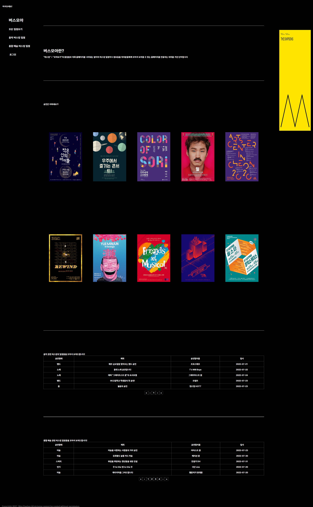

# React CRUD Project - Busmoa

### 프로젝트 목적
>"코로나 팬데믹이 종결된 후 사람들이 가장 하고 싶은 것은 무엇일까?"라는 질문에 많은 사람들이 여행, 유흥등을 얘기했지만 적지 않은 수의 시민들이 "문화 생활"이라고 대답한 것에 착안하여 거리 공연을 하고 싶은 사람들과 거리 공연을 보고 싶은 사람을 연결시켜 줄 수 있는 연결 다리를 만들어보자는 생각으로 기획하게됐습니다.  

---

### 진행 과정
1. 초기 스케치
  
   

     위 그림과 같이 레이아웃 스케치후 작업을 진행하였다

2. 기능 요구서  
   * 회원가입
   * 게시판 CRUD
   * 게시판글의 위치 정보를 이용한 날씨 API
   * 사이드바 유튜브 영상 재생
   * SPA일 것
   * React로 작성할 것
   * NGINX
   * AWS ec2를 이용해 배포 할 것

3. 과정 설명  
    * SPA을 위해 react로 설정  
    * CRUD를 위한 DB로 MySQL 설정
    * 유튜브 영상이 아닌 라이브러리를 쓰지않고 사이드바 슬라이드 구현 
    * 스크롤 이벤트로 배경색을 바꾸는 것을 추가 
    * 회원가입을 위해 session을 사용
    * ubuntu 환경에서 배포했으며 m2.micro를 사용하였다
    
    이렇게 변경한뒤 HTML작업과 가시성을 위해 CSS를 간단하게 작성하였다.

4. 기능 구현을 위한 첫 도전!  
    * React를 사용하기 위해 React 공부
    * 라이브러리를 쓰지 않고 사이드바를 구현하기 위해 자바스크립트 문법 공부
    * 배포를 위해 NGINX 및 AWS EC2 공부
---

### 결과물
1. 실행 설명  
   * 무중단 배포를 위해 PM2로 server.js 실행
2. 결과
      

    http://www.busmoa.link/busking
---

### 새롭게 습득한 스킬

 

### 추후 개선 방향

* 반응형 웹
* session이 아닌 JWT를 활용한 로그인 방식  
